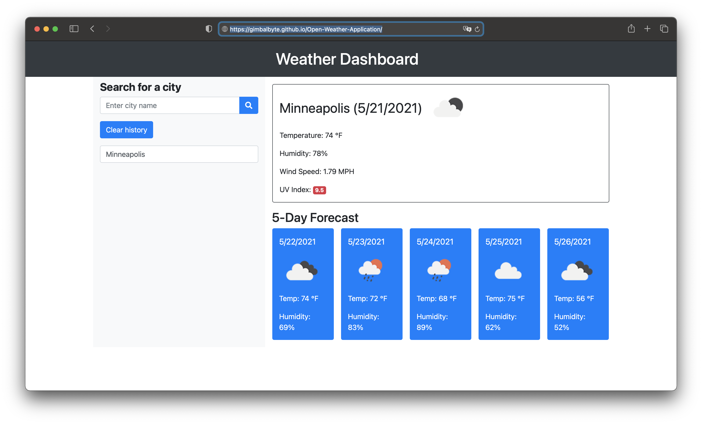

# Open-Weather-Application

Description
    This application is a weather reporting app. The purpose and design of the application is for a user to enter a name of a city in the search area, and then The app will display the current weather conditions in that city. When displaying the information it will include the temperature, the humidity, the UV index, and a picture representing of the overcast condition. The application will display a 5 day forecast for the entered city.

    When a user searches a button showing what was searched will be created underneath. The user may click the button, and a new search will be done. The information searched will remain on the page until the clear history button is clicked. The clear history button will clear the local storage.

Image
    
Link
     [Open Weather](https://gimbalbyte.github.io/Open-Weather-Application/)
